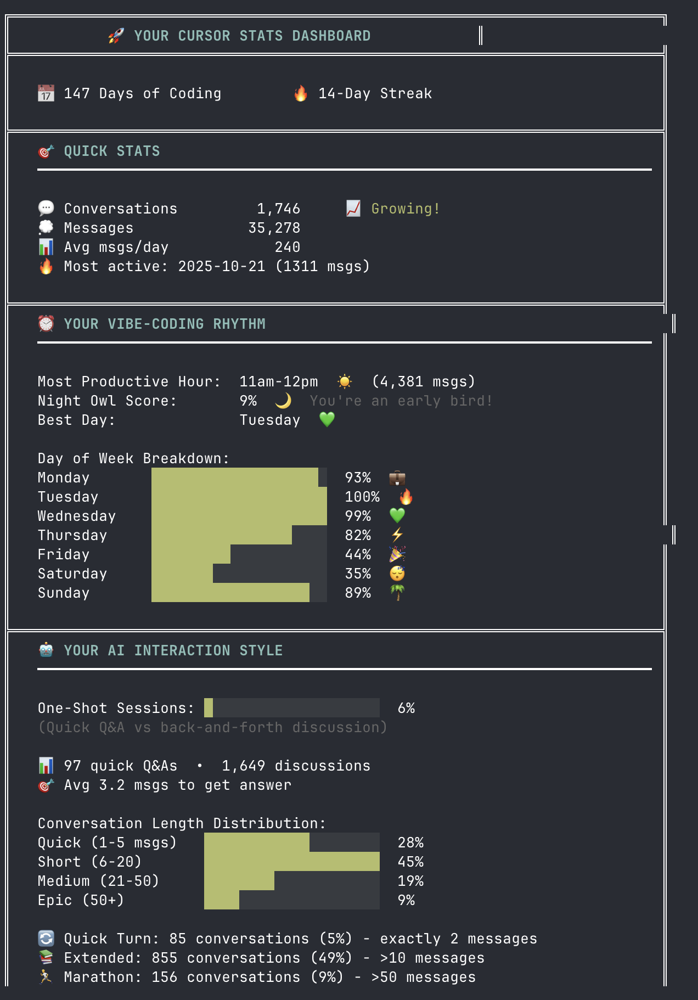

# Cursor Stats

<div align="center">
    
</div>

> 📊 **Analyze your Cursor IDE usage with beautiful, engaging statistics!**

An interactive command-line tool that reads your Cursor IDE database and reveals fascinating insights about your AI-assisted coding habits, productivity patterns, and vibe-coding personality.

[](https://opensource.org/licenses/MIT)
[](https://nodejs.org/)

---

## ✨ What is Cursor Stats?

Cursor Stats transforms your Cursor IDE usage data into an **engaging, gamified experience**. It analyzes thousands of conversations and messages to show you not just *what* you coded, but *how* you work with AI.

**Think of it as:**
- 🎮 **GitHub Wrapped** for Cursor IDE
- 📈 **Google Analytics** for your AI usage
- 🎯 **Spotify Wrapped** meets coding metrics

---

## 🚀 Quick Start (Recommended)

Thanks to zero native dependencies, you can run it instantly without installation:

```bash
# Using npx (recommended - always use @latest)
npx -y cursor-stats@latest

# Using bunx (Bun users)
bunx cursor-stats

# Other package runners
pnpm dlx cursor-stats
pnpx cursor-stats
```

> 💡 **Tip**: Use `@latest` with npx to ensure you get the newest features and bug fixes.

**First run?** The tool automatically:
- Finds your Cursor database
- Analyzes your entire history (processes ~35,000 messages in under 3 seconds)
- Launches an interactive menu

---

## 🚀 Features

### 📊 Dashboard - The Big Picture
Your complete AI coding journey at a glance:
- **Quick Stats**: Conversations, messages, coding days, current streak
- **AI Interaction Style**: Agentic mode %, one-shot vs multi-shot sessions
- **Vibe-Coding Snapshot**: Your mood, tasks, thinking mode, confidence
- **Hour-by-Hour Activity**: Visual charts showing when you code
- **Achievements Unlocked**: Gamified milestones based on your usage
- **Fun Facts**: Interesting insights about your coding patterns

### 🔍 Deep Dive - Analyze Everything
Interactive exploration of detailed metrics:
- **📈 Activity Trends**: Daily/weekly/monthly patterns with insights
- **💬 Conversation Patterns**: Session lengths, efficiency, communication style
- **⏰ Time Machine**: Peak hours, day-of-week patterns, night owl score
- **🤖 AI Interaction**: Context usage, agentic vs chat mode breakdown
- **✨ Vibe-Coding Insights**: Emotions, learning patterns, task distribution

### 💪 Pushup Challenge - Track Claude's Validation Habit
Making fun of AI being too agreeable:
- Count every "you're absolutely right", "spot on", "you nailed it"
- Track by day/week/month/quarter/year with **streaks**
- **Level system**: From "Beginner" to "Mythical"
- Top phrases leaderboard showing Claude's favorites
- **The joke**: Tracking how often Claude validates your ideas 😄

### ✨ Vibe-Coding Insights
Deep personality analysis of your coding style:
- **🎭 Emotional Journey**: Frustration, excitement, confusion, gratitude, CAPS LOCK rage
- **🧠 Learning Style**: Questions asked (how/why/what), teaching back, AHA moments
- **🎯 Thinking Mode**: Deep thinking vs speed mode vs experimental
- **🛠️ Task Distribution**: Fix vs add vs refactor breakdown with stats
- **🎚️ Confidence Meter**: Certain vs uncertain language patterns
- **💬 Communication Style**: Polite vs direct vs collaborative
- **🎯 Session Style**: One-shot (quick Q&A) vs multi-shot (discussions)

### 📤 Export & Settings
- Export reports in Markdown, JSON, or Text format *(coming soon)*
- Configure preferences and database location

---

## 🎨 Design Philosophy

### Engaging over Boring
- ✅ **Gamification**: Achievements, levels, streaks
- ✅ **Visual charts**: Progress bars, hour-by-hour activity
- ✅ **Emoji-rich**: Makes data fun and scannable
- ✅ **Personality insights**: "Quick Draw", "Deep Diver", "The Boss"

### Consolidated over Cluttered
- ✅ **4 main sections** (not 8+ menus)
- ✅ **Dashboard shows everything** at a glance
- ✅ **Deep Dive** organized with clear sub-menus
- ✅ **No fake metrics** (no "Top 15% of users")

### Privacy First
- ✅ **100% local** - reads only from your Cursor database
- ✅ **No data sent anywhere** - completely offline
- ✅ **Read-only access** - never modifies your database

---

## 📸 Screenshots

### Main Menu
```
╔════════════════════════════════════════════════╗
║    🚀 CURSOR STATS - Your AI Journey           ║
╚════════════════════════════════════════════════╝

? What would you like to see?
❯ 📊 Dashboard - The Big Picture
  🔍 Deep Dive - Analyze Everything
  💪 Pushup Challenge - Track Your "Rights"
  📤 Export & Settings
  ──────────────
  👋 Exit
```

### Dashboard Example
Shows your complete overview:
- 🎯 **Quick Stats**: 1,732 conversations, 34,994 messages
- ⏰ **Vibe-Coding Rhythm**: Peak hours with visual charts
- 🤖 **AI Interaction Style**: Agentic mode % and session patterns
- ✨ **Vibe-Coding Snapshot**: Mood, tasks, confidence, communication
- 🏆 **Achievements**: "Night Owl", "Marathon Chatter", "Quick Draw"

### Pushup Challenge
```
💪 THE PUSHUP CHALLENGE 💪
How often does Claude say "you're absolutely right"?

🎯 CLAUDE'S VALIDATION HABIT
  All Time:         883 times  😅
  Current Streak:   3 days  🔥
  Best Streak:      12 days  🏆

📊 BREAKDOWN
  Today          ██████░░░░  42
  This Week      ████████░░  156  ↗️ +23 vs last week
  This Month     ██████████  289

🎤 CLAUDE'S FAVORITE PHRASES
  1. "you're absolutely right"    234 times  🥇 Classic Claude
  2. "spot on"                    156 times  🥈 Always this one
```

---

## 🛠️ How It Works

1. **Reads Cursor Database** from platform-specific location:
   - **macOS**: `~/Library/Application Support/Cursor/User/globalStorage/state.vscdb`
   - **Windows**: `%APPDATA%/Cursor/User/globalStorage/state.vscdb`
   - **Linux**: `~/.config/Cursor/User/globalStorage/state.vscdb`

2. **Analyzes Conversations**: Handles both legacy and modern Cursor database formats

3. **Computes Statistics**:
   - Core stats: Activity, conversations, time patterns, engagement
   - Keyword-based stats: Emotions, learning, tasks, thinking modes
   - Validation phrase tracking (Claude's agreeable responses)

4. **Interactive Display**: Beautiful CLI with colors, progress bars, and emojis

---

## 📋 Requirements

- **Node.js 18+** (the tool checks and warns if version is too old)
- **Cursor IDE** installed with conversation history
- **No native dependencies** - works everywhere with pure JavaScript/WASM

---

## 🛠️ Development / Local Installation

For contributors or those who want to run from source:

```bash
# Clone the repository
git clone <repository-url>
cd cursor-stats

# Install dependencies
npm install

# Build TypeScript
npm run build

# Run the tool
npm start

# Or use dev mode (build + run in one command)
npm run dev
```

### Global Installation

```bash
# Install globally from npm (once published)
npm install -g cursor-stats

# Or link for local development
npm link

# Then run from anywhere
cursor-stats
```

---

## 📚 Data Analyzed

Typical database analysis:
- **1,700+ conversations** with detailed metadata
- **35,000+ messages** (user questions + AI responses)
- **147 days** of coding history
- **Timestamps**, context usage, agentic mode flags
- **Message content** for keyword and validation phrase detection

---

## 🎮 Usage & CLI Options

```bash
# Interactive mode (default)
npx -y cursor-stats@latest

# Output JSON for scripting
npx -y cursor-stats@latest --json

# Show version
npx -y cursor-stats@latest --version

# Show help
npx -y cursor-stats@latest --help

# Disable colors
npx -y cursor-stats@latest --no-color
```

> 💡 If you installed globally, simply use `cursor-stats` instead of the npx command.

---

## 🏗️ Project Structure

```
cursor-stats/
├── src/
│   ├── lib/
│   │   ├── database.ts       # SQLite reader (legacy + modern formats)
│   │   ├── analyzer.ts       # Statistics computation (12 stat categories)
│   │   └── formatters.ts     # Display utilities (boxes, bars, charts)
│   ├── cli/
│   │   ├── menu.ts           # Interactive menu system
│   │   ├── dashboard.ts      # Main dashboard view
│   │   ├── pushup-challenge.ts # Claude validation tracker
│   │   └── vibe-stats.ts     # Keyword-based insights
│   └── index.ts              # Entry point with signal handlers
├── bin/
│   └── cursor-stats.js       # Executable with Node version check
├── dist/                     # Compiled JavaScript (generated)
└── package.json
```

---

## 🔧 Tech Stack

- **TypeScript** - Type safety and better DX
- **sql.js** - Pure JavaScript SQLite (no native dependencies)
- **inquirer** - Interactive command-line menus
- **chalk** - Terminal colors and styling
- **ora** - Elegant terminal spinners
- **date-fns** - Modern date manipulation
- **commander** - CLI argument parsing

---

## 🎯 Achievements System

Unlock achievements based on your behavior:
- 🔥 **Hot Streak** - 7+ consecutive coding days
- 🦉 **Night Owl** - 25%+ activity after midnight
- 😤 **CAPS LOCK Rage** - 50+ frustrated messages in ALL CAPS
- 🎓 **Eternal Student** - 500+ questions asked
- 👨‍🏫 **The Professor** - Taught AI back 50+ times
- 💡 **Lightbulb Collector** - 100+ AHA moments
- 🧠 **Deep Thinker** - 20+ ultrathink requests
- ⚡ **Speedrunner** - 100+ quick/fast requests
- 🐛 **Bug Hunter** - Fix more than you build
- ✨ **Creator** - Build more than you fix
- ⚡ **Quick Draw** - 80%+ one-shot sessions
- 🏊 **Deep Diver** - Loves long conversations

---

## 📝 License

MIT